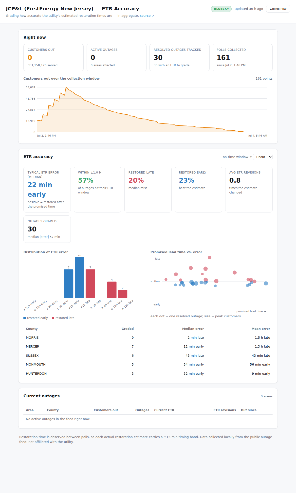

# JCP&L ETR Accuracy Tracker

A web app that watches the **JCP&L / FirstEnergy** outage map and grades how
accurate the utility's **Estimated Restoration Times (ETRs)** turn out to be —
in aggregate.

When your power goes out, JCP&L publishes a restoration estimate. This tool
records that estimate over time, notices when each outage actually clears, and
compares the **last promised ETR** against the **actual restoration time**
across every outage it has seen. The result is a running scorecard: are their
estimates optimistic, pessimistic, or on the money?

Source feed: <https://outages-nj.firstenergycorp.com/>



## How it works

The FirstEnergy outage map is powered by KUBRA's StormCenter platform, which
serves outage data as public JSON. Each poll, the collector walks this chain:

1. **currentState** → the current per-update data directory
2. **configuration** → the summary + area-report file names
3. **summary** → system-wide totals (customers out, number of outages)
4. **report** → a state → county → **township** hierarchy where every township
   carries a `cust_a` (customers affected), `n_out`, and — crucially — an
   **`etr`** (estimated restoration time)

The township ETR is the unit we grade.

### From snapshots to a scorecard

Each township outage is tracked as an **episode**: a continuous stretch during
which that township has customers out. An episode:

- **opens** when the township first appears in the feed with customers out,
- **records** every ETR it's given (including revisions), and
- **closes** when the township drops out of the feed (power restored).

Because we only see the feed at poll time, the true restoration happened
somewhere between the last poll the outage was present and the first poll it
was gone. We estimate it at the **midpoint**, and surface the half-interval
(`± poll interval`) as the timing uncertainty.

For each closed episode with an ETR on record:

```
error = actual_restoration − final_promised_ETR
  error > 0  → restored LATER than promised   (estimate was optimistic)
  error < 0  → restored EARLIER than promised  (beat the estimate)
```

The dashboard aggregates these into a median/mean error, an on-time rate
(within an adjustable ± window), an early/late split, an error-distribution
histogram, a promised-lead-time-vs-error scatter, and a per-county breakdown.
The same township can have many episodes over time (a new storm = a new
episode), so re-outages never get confused with the original.

## Quick start

```bash
npm install
npm start          # dashboard on http://localhost:3000, polls every 15 min
```

The server polls on boot and then every `POLL_MINUTES`. Accuracy numbers appear
once outages start resolving — a single snapshot only shows the current
picture, so **leave it running** (through a storm and its recovery is ideal).

Collect a single snapshot without the server (for cron-style setups):

```bash
npm run collect
```

### See it fully populated (synthetic demo)

Accuracy needs resolved outages, which takes time to accumulate. To preview the
full dashboard immediately with a **fabricated** storm:

```bash
node src/seed-demo.js
DB_PATH=data/demo.db npm start
```

> The demo numbers are invented to exercise the UI — they are **not** real
> utility performance. Delete `data/demo.db` and collect live data for that.

## Configuration

All via environment variables (see `src/config.js`):

| Var | Default | Purpose |
| --- | --- | --- |
| `PORT` | `3000` | Dashboard port |
| `POLL_MINUTES` | `15` | Poll interval (also the resolution-timing uncertainty) |
| `DB_PATH` | `data/outages.db` | SQLite file |
| `NO_SCHEDULER` | — | Set to `1` to disable the built-in poller |
| `KUBRA_INSTANCE_ID` / `KUBRA_VIEW_ID` | JCP&L's | Point at another FirstEnergy operating company |
| `UTILITY_NAME` / `SOURCE_URL` | JCP&L | UI labels |

Because the utility identifiers are just config, the same app can track
Met-Ed, Penelec, West Penn, Ohio Edison, etc. — grab their `instanceId` /
`viewId` from that map's page source (`var BOOTSTRAP_CONFIG`).

## API

| Endpoint | Returns |
| --- | --- |
| `GET /api/status` | Collection status + latest snapshot totals |
| `GET /api/current` | Currently-open outages |
| `GET /api/accuracy?window=60` | Aggregate accuracy (± window in minutes) |
| `GET /api/episodes` | Graded (resolved, ETR-bearing) episodes |
| `GET /api/timeseries` | Customers-out over the collection window |
| `POST /api/collect` | Trigger one poll now |

## Methodology notes & caveats

- **Granularity is township-level**, matching what the public feed exposes.
  This is the right altitude for an *aggregate* accuracy question.
- **Timing uncertainty** equals the poll interval; tighten `POLL_MINUTES` for
  sharper resolution timestamps (at the cost of more requests).
- Outages that **never carry an ETR** (e.g. during active storm assessment) are
  tracked but excluded from grading — you can't grade an estimate that was
  never made. They're still counted so you can see how often that happens.
- During major events the feed may switch to a **STORM** page mode and suppress
  or coarsen ETRs; the current page mode is shown in the header.
- This is an independent tool built on public data. **Not affiliated with,
  endorsed by, or connected to JCP&L or FirstEnergy.**

## Development

```bash
npm test           # verifies the episode lifecycle + accuracy math
```

## Layout

```
src/
  config.js      utility IDs + tunables (env-overridable)
  kubra.js       KUBRA StormCenter feed client
  db.js          SQLite schema + episode lifecycle (the core model)
  analytics.js   accuracy math + dashboard queries
  collector.js   one poll → DB (CLI + importable)
  server.js      dashboard + JSON API + built-in scheduler
  seed-demo.js   synthetic storm for previewing the UI
public/          dashboard (vanilla JS + hand-rolled SVG charts, no CDN)
test/            accuracy + episode tests
```
